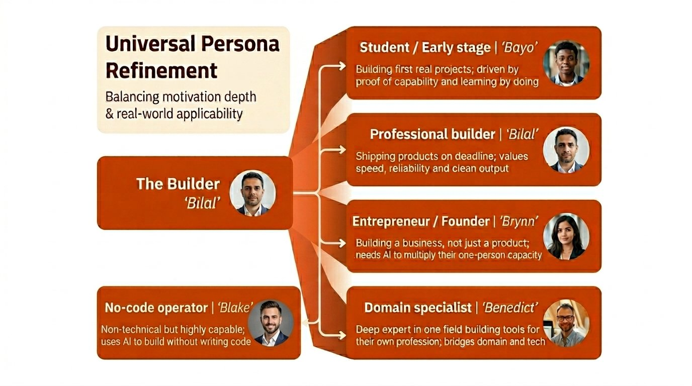

# The Builder Refinement
## Five contextual variants of the Builder persona

> *The Builder's axis position — outcome-led, independent — holds constant. What varies is context: life stage, technical fluency, scale of ambition, and what 'shipping' actually means.*

[Return to The Builder parent persona](../Builder.md) · [Return to README](../../README.md)

  

---

## Why Builder has sub-personas first

The Builder persona covers an unusually wide contextual range: a GCSE student building their first working thing, a staff engineer shipping production systems, a solo founder trying to replace a salary, a 20-year domain specialist finally building something in their field, and a non-technical operator who has never written a line of code but is now shipping AI-orchestrated workflows.

All five of them are outcome-led. All five are independent. They would all recognise themselves in the parent Builder description. But the content, tools, and messaging that reach them differ enormously — which is exactly what sub-personas are for.

The naming convention: **all Builder sub-personas start with B**. Other parent personas follow the same rule for their respective letters (A for Architect, E for Explorer, C for Connector, S for Steady).

---

## 📇 The five sub-personas at a glance

| Sub-persona | Life stage / context | Central question |
|---|---|---|
| 🎓 **Bayo** | Student / early-stage builder | *"Can I prove I can actually do this?"* |
| 🛠️ **Bilal** | Professional builder (core) | *"How do I ship this by Friday?"* |
| 🚀 **Brynn** | Entrepreneur / founder | *"How do I multiply my one-person capacity?"* |
| 🧠 **Benedict** | Domain specialist | *"How do I build tools for my profession?"* |
| 🧩 **Blake** | No-code operator | *"How do I ship without writing code?"* |

---

## 🎓 Bayo — Student / Early-Stage Builder

> *"I'm building my first real thing. I need it to actually work."*

**Who they are.** Bayo is in education, early in a self-taught journey, or in the first year or two of a career. They are capable, motivated, and somewhat time-rich — but experience-poor. They're driven by **proof of capability**: the satisfying click of a thing working, the portfolio piece, the screenshot they can show a friend.

**What they need from AI tools.**
- Confidence-building defaults — the first build should succeed
- Teaching-as-you-work, not teaching-before-you-work
- A visible line between "the AI did this" and "I did this" so they can learn
- Free-tier access that doesn't run out three hours into a project

**Where to reach them.** YouTube, short-form video, Discord communities, university and bootcamp channels, creators who themselves were recently Bayo.

**Red flags.** Paywalls on anything useful; documentation that assumes production experience; communities dominated by Bilals who dismiss beginner questions.

---

## 🛠️ Bilal — Professional Builder (core)

> *"I have a week. I need this shipped."*

**Who they are.** Bilal is the central, archetypal Builder — mid-career, experienced, working inside a company or as a freelancer, with a real deadline and real stakes. They are paid to ship and they know what shipping feels like.

**What they need from AI tools.**
- Time-to-first-result measured in minutes
- A defensible answer to "will this work at production scale?"
- Integration into an existing stack — API, webhooks, export
- Predictable pricing that scales with usage

**Where to reach them.** Practitioner communities (Hacker News, r/programming, specialised Slacks), trusted newsletters, peer recommendations, build-in-public Twitter/X.

**Red flags.** Sales gating on basic features; marketing that talks about "AI journeys"; tools that require a workflow change before producing output.

---

## 🚀 Brynn — Entrepreneur / Founder

> *"I'm a company of one. I need AI to be the other twelve."*

**Who they are.** Brynn is building a business, not just a product. They are running everything — product, marketing, sales, operations, customer support, finance — with whatever leverage they can find. AI is not a novelty for Brynn; it's the reason the business is viable at this scale.

**What they need from AI tools.**
- Multi-domain capability: it has to handle the legal doc *and* the landing page copy *and* the customer email
- Delegation that actually works — tasks that don't need to be re-checked
- Cost-effectiveness — every tool is evaluated against "could I afford to hire a human instead?"
- Trustworthy output when no one else is reviewing

**Where to reach them.** Founder communities (Indie Hackers, YC forums, specialised founder circles), build-in-public creators, peer case studies, practitioner-led podcasts.

**Red flags.** Tools priced for enterprises; community content dominated by employees of big companies whose problems don't match; AI assistants that need a lot of supervision.

---

## 🧠 Benedict — Domain Specialist

> *"I've spent twenty years in this field. I want to build tools for the people still in it."*

**Who they are.** Benedict is a deep expert in a specific non-software domain — medicine, law, accountancy, education, engineering, research, a trade. They've accumulated expertise that, until recently, didn't translate into software. AI has lowered the barrier enough that Benedict can now ship tools that encode their expertise, often for the first time.

**What they need from AI tools.**
- Respect for their domain expertise — the tool should not over-explain their own field to them
- Reliable structured output — the specific schemas their field needs
- Privacy and compliance handling appropriate to their domain (regulated industries especially)
- A bridge between their domain vocabulary and the technical vocabulary of the tool

**Where to reach them.** Domain-specific publications, professional associations, CPD channels, peer networks, domain-AI case studies by respected practitioners.

**Red flags.** Marketing that condescends to non-programmers; tools with no privacy story in regulated fields; forums dominated by generic advice that ignores domain specifics.

---

## 🧩 Blake — No-Code Operator

> *"I don't write code. I ship anyway."*

**Who they are.** Blake is non-technical by traditional measures but is shipping production workflows using AI plus no-code and low-code tooling. They may run growth, operations, or customer experience at a small company, or run their own agency orchestrating AI-driven services. Blake is often underestimated by technical teams and routinely out-ships them on the work that matters to the business.

**What they need from AI tools.**
- Visual or chat-based interfaces — code-first tooling excludes them
- First-class integrations with the no-code stack (Zapier, Make, Airtable, Notion, etc.)
- Pattern libraries for common business workflows
- Community that doesn't gatekeep — they are builders, just not developers

**Where to reach them.** No-code communities, agency-operator circles, LinkedIn (yes, really), practitioner-led YouTube channels, Makerpad-style tutorial libraries.

**Red flags.** Documentation that requires reading a code sample to understand; communities that treat no-code as an inferior approach; pricing tiers that punish usage without warning.

---

## How to use this refinement

When you're designing a feature, a piece of content, or a campaign **for Builders**, pick the sub-persona first. Bayo and Brynn will both read the same case study and have opposite reactions:

- Bayo needs to see that *someone like them* managed to ship it
- Brynn needs to see that *someone further along* used it to cut a sales rep or an agency

The parent Builder page tells you *what they all share*. This page tells you *what separates them*. Both are needed.

---

### Licensing and attribution
Published under [CC-BY-4.0](https://creativecommons.org/licenses/by/4.0/). You can adapt, remix, and build on this freely with attribution.
