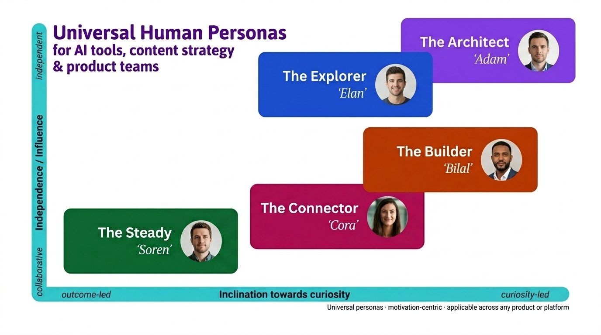

# Universal Human Personas
### Motivation-centric personas for AI tools, content strategy & product teams

> *"A curious independent is a curious independent whether they're writing code, writing copy, or writing a thesis. They want the same kind of thing from the tool in front of them."*

<p align="center">
  
</p>

---

## Why this exists

Most persona frameworks are **job-title-centric** — "The CTO," "The Frontend Developer," "The Marketing Manager." They stop being useful the moment you step outside the industry they were built for, and they age poorly because roles drift faster than motivations do.

This repository adapts [Cliff Simpkins' excellent **dev-personas**](https://github.com/cliff-simpkins/dev-personas) framework into something portable. Simpkins built five motivation-centric archetypes for developers. I've generalised them to any human using modern tools — particularly AI tools, content platforms, and new products where the *job title* of the user tells you almost nothing useful about how to serve them.

The axes, the structure, and the underlying insight are his. The universalisation is mine.

---

## The five personas

| Persona | One-line | Axis position |
|---|---|---|
| 🟣 [**The Architect** *'Adam'*](Personas/Architect.md) | Sees systems. Wants depth, frameworks, first principles. | Curiosity-led · Independent |
| 🔵 [**The Explorer** *'Elan'*](Personas/Explorer.md) | Follows rabbit holes. Thinks through conversation. | Curiosity-led · Collaborative |
| 🟠 [**The Builder** *'Bilal'*](Personas/Builder.md) | Ships things. Wants results, not theory. | Outcome-led · Independent |
| 🩷 [**The Connector** *'Cora'*](Personas/Connector.md) | Thinks through people. Needs help communicating. | Outcome-led · Collaborative |
| 🟢 [**The Steady** *'Soren'*](Personas/Steady.md) | Needs reliability, clarity, and proven answers. | Outcome-led · Centre |

Every persona in this repository has a name starting with the letter of their archetype — Adam, Elan, Bilal, Cora, Soren. Sub-personas follow the same rule (see [the Builder refinement](Personas/sub-personas/Builder.md) for an example: Bayo, Bilal, Brynn, Benedict, Blake).

---

## The two axes

<table>
<tr>
<td width="50%">

### X axis — Inclination towards curiosity

**Outcome-led** ◀ ─────────── ▶ **Curiosity-led**

*"I need this done"* ◀ ─── ▶ *"I want to understand this"*

Outcome-led users reach for a tool to finish a task. Curiosity-led users reach for a tool to open a door.

</td>
<td width="50%">

### Y axis — Independence / Influence

**Collaborative** ▼ ─────────── ▲ **Independent**

*"Think with me"* ▼ ───── ▲ *"Give me room to work"*

Collaborative users process by bouncing ideas off others (or an AI). Independent users process alone and want the tool out of their way.

</td>
</tr>
</table>

Read [**the full axes explanation**](framework/axes-explained.md) for the reasoning behind the placements and why "centre" is a valid position for Soren.

---

## Using this framework

### 🧠 If you're designing an AI tool
The five personas want fundamentally different things from the same feature. The Architect wants a system prompt they can see and shape. The Builder wants a one-click default that works. The Explorer wants conversational back-and-forth. The Connector wants tone controls. The Steady wants a template that won't embarrass them. Build for all five and you build a product that scales beyond the early-adopter curve.

### ✍️ If you're writing content or docs
Pick the persona you're writing *for*, not the persona you *are*. A reference doc written for Adam will bore Bilal and intimidate Soren. Use the per-persona "red flags" and "effective strategies" sections as a pre-flight check.

### 🧭 If you're a product or sales team
Different personas buy for different reasons and resist for different reasons. The per-persona **Key Questions to Answer** sections tell you what objections to pre-empt before they're raised.

---

## Repository structure

```
universal-personas/
├── README.md                         ← you are here
├── LICENSE                           ← CC-BY-4.0
├── CONTRIBUTING.md
├── framework/
│   └── axes-explained.md             ← the two axes, in depth
├── Personas/
│   ├── Architect.md                  ← 🟣 Adam
│   ├── Explorer.md                   ← 🔵 Elan
│   ├── Builder.md                    ← 🟠 Bilal
│   ├── Connector.md                  ← 🩷 Cora
│   ├── Steady.md                     ← 🟢 Soren
│   └── sub-personas/
│       └── Builder.md                ← Bayo · Bilal · Brynn · Benedict · Blake
└── diagrams/
    ├── axis-map.png                  ← the five personas, plotted
    └── builder-refinement.png        ← parent → sub-personas fan
```


The personas in this repository are fictional. Any resemblance to real people is coincidental and unintended.
